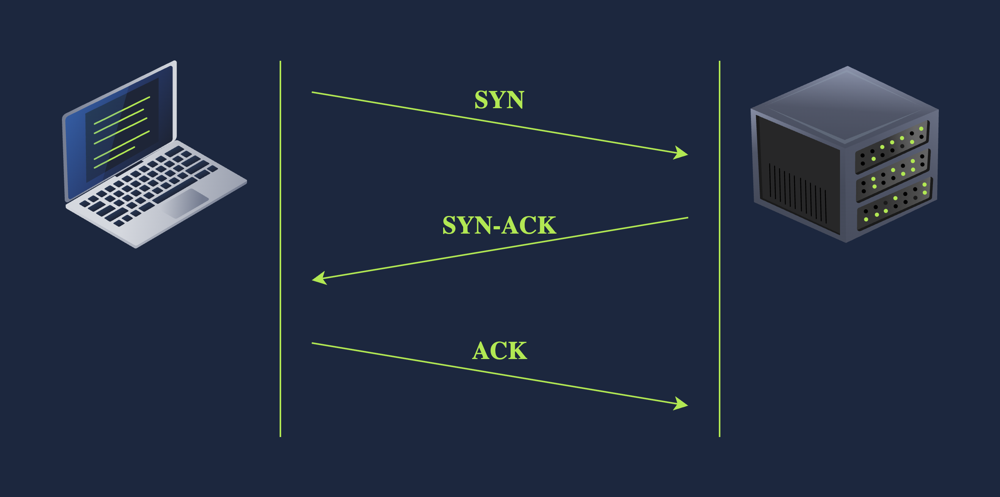
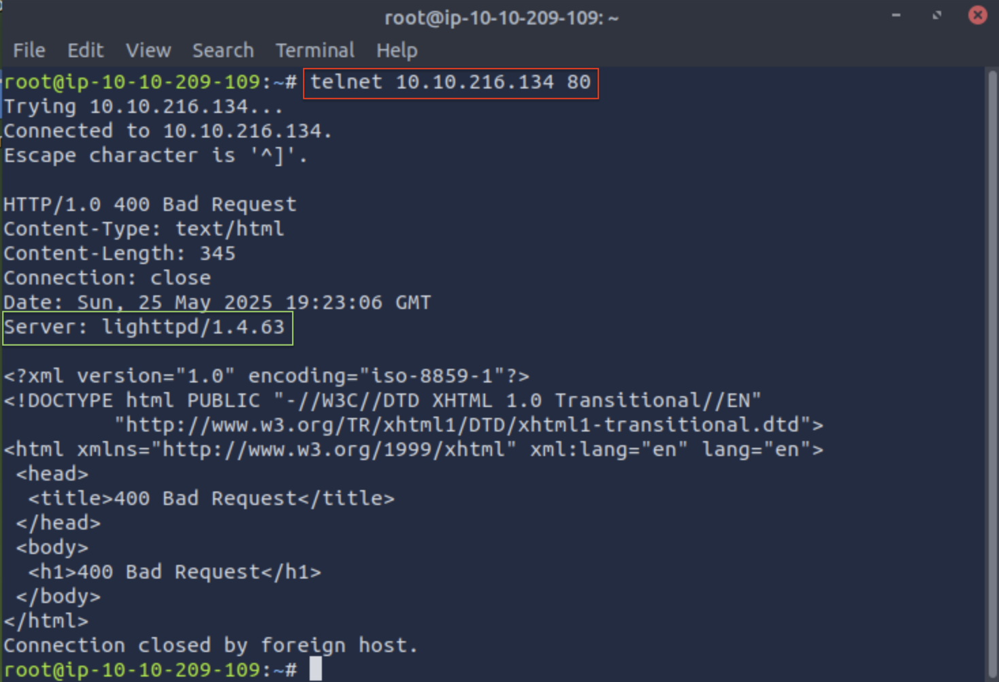
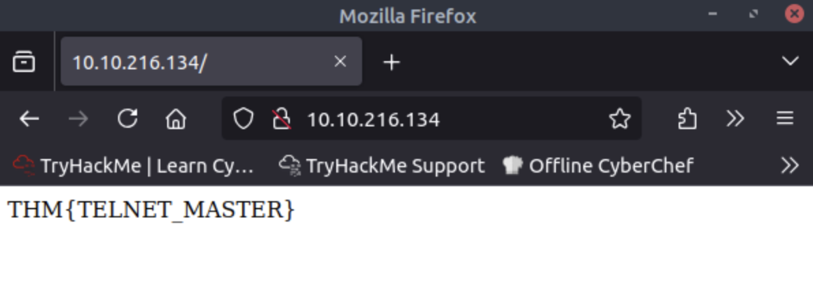

**Difficulty:** Easy  
**Subscription:** Free  
Click [here](https://tryhackme.com/room/networkingconcepts) to access the room

---
> **Note**: This write-up is a concise guide meant to complement the TryHackMe Networking Concepts room. It is not a comprehensive theoretical resource but rather a practical walkthrough of key concepts and tasks. For deeper explanations, refer to the room materials or other Networking documentation.

> **Note**: If you come across abbreviations or terms you’re unsure about, check the [Networking Glossary](../Networking-Glossary), most of them should be explained there!

## Room Setup
In Task 7, you'll need to:
1. Press the **Start Machine** button to launch the target machine.
2. If you want to work directly in the browser, press **Start AttackBox** at the top of the page. This will open a split-screen terminal you can use. <ins>Alternatively</ins>, if you’re connected to the TryHackMe VPN, you can use your own local terminal, just note the **Target IP** provided.

Give both machines ~2 minutes to fully boot. Once ready, open a terminal (in the AttackBox or your local system) to start experimenting with *telnet*.

---
## 🧩 Tasks Breakdown
### Task 2

#### ❓ Which layer is responsible for end-to-end communication between running applications?

**Answer:** 4

**Explanation:**  Layer 4 is the Transport Layer. It enables end-to-end communication between running applications on different hosts. If you are finding it hard to grasp the concept, watch [this](https://youtu.be/RdtuBtgWAw0?si=snY_qV30arOvmWzr) video and it will become much clearer.

#### ❓ Which layer is responsible for routing packets to the proper network?
**Answer:**  3

**Explanation:**  Layer 3 is the Network Layer. It handles logical addressing and routing, i.e., finding a path to transfer the network packets between the diverse networks. [Here](https://www.youtube.com/watch?v=ql0axyWZYUw) is a nice video about it.

#### ❓ In the OSI model, which layer is responsible for encoding the application data?
**Answer:**  6

**Explanation:**  Layer 6 is the Presentation Layer. It ensures the data is delivered in a form the application layer can understand. It handles data encoding, compression and encryption. Again, [here](https://www.youtube.com/watch?v=qnEFsoz-cwQ) is a cool video.

#### ❓ Which layer is responsible for transferring data between hosts on the same network segment?
**Answer:**  2

**Explanation:**  Layer 2 is the Data Link Layer. It represents the protocol that enables data transfer between nodes on the same network segment. [Here](https://www.youtube.com/watch?v=BOkH_B_8rcs) is a video to complement the explanation given in the room.

<small>As you may have noticed, I especially enjoyed the explanations in [Tall Paul Tech's videos](https://www.youtube.com/@TallPaulTech). [Here](https://www.youtube.com/watch?v=YE0S91xc64I&list=PLGvkW0sr-RWYdqxQEx3aCx4cxZP7DvSur&index=9) is the playlist so you can check out the rest of the layers.</small>

### Task 3

#### ❓ To which layer does HTTP belong in the TCP/IP model?
**Answer:**  Application Layer

**Explanation:**  So far, we’ve been going over ISO OSI, but this is just a conceptual model, something to help us understand how different computer systems communicate over a network. TCP/IP, on the other hand, is an actual implemented model, but we can map its layers to those of the OSI model. In TCP/IP, the OSI Application, Presentation and Session layers are combined into the Application layer. The Transport layer stays the same, the Network layer becomes the Internet layer and the Data Link layer is called the Link layer. You might notice the Physical layer seems missing, but nowadays when people talk about the TCP/IP model, they often refer to it with five layers instead of four. Knowing this, just like HTTP belongs to the Application layer in the OSI model, it also belongs to the Application layer in the TCP/IP model.

#### ❓ How many layers of the OSI model does the application layer in the TCP/IP model cover?
**Answer:**  3

**Explanation:**  As mentioned above, the application layer in the TCP/IP model covers the OSI Application, Presentation and Session layers.

### Task 4
#### ❓ Which of the following IP addresses is not a private IP address?
- 192.168.250.125
- 10.20.141.132
- 49.69.147.197
- 172.23.182.251
  
**Answer:**  49.69.147.197

**Explanation:**  RFC 1918 defines the following private IP address ranges:
- 10.0.0.0 – 10.255.255.255
- 172.16.0.0 – 172.31.255.255
- 192.168.0.0 – 192.168.255.255

192.168.250.125 falls within the 192.168.0.0 – 192.168.255.255 private range, 10.20.141.132 falls within 10.0.0.0 – 10.255.255.255 and 172.23.182.251 falls within 172.16.0.0 – 172.31.255.255. 49.69.147.197 is the one that is a public IP address. I find it easier to memorize like this: the private addresses can start with 10.x.x.x or 192.168.x.x or be in the 172.16.0.0 - 172.31.255.255 range, where `0 ≤ x ≤ 255`. 
  

#### ❓ Which of the following IP addresses is not a valid IP address?
- 192.168.250.15
- 192.168.254.17
- 192.168.305.19
- 192.168.199.13

**Answer:**  192.168.305.19

**Explanation:**  192.168.305.19 is not a valid address because the third octet (192.168.**305**.19) is not between 0 and 255. An octet is 8 bits and, as such, it can only represent a decimal number between 0 and 255.

### Task 5
#### ❓ Which protocol requires a three-way handshake?
**Answer:**  TCP

**Explanation:**  UDP is connectionless and doesn't require a handshake before data transfer. TCP is connection-oriented, so it requires the establishment of a TCP connection before any data can be sent. This connection is established using what’s called a three-way handshake. This is what it looks like:

*Image source: TryHackMe*

#### ❓ What is the approximate number of port numbers (in thousands)?
**Answer:**  65

**Explanation:**  A port number is made up of two octets. Since an octet is 8 bits, this gives us a total of 16 bits for a port number. With 16 bits, we can represent `2^16 = 65 536` possible values. However, [port 0 is reserved](#-what-is-the-port-number-0-reserved-for), so the valid port number range is actually from 1 to 65 535 (`2^16 - 1 = 65 535`). So roughly rounding down, we can say there are about 65 thousand ports.

### Task 6
#### ❓ On a WiFi, within what will an IP packet be encapsulated?
**Answer:**  Frame

**Explanation:**  The IP packet (from the Network layer) needs to be encapsulated inside a frame (in the Data Link Layer) so it can be transmitted over the Physical layer.

#### ❓ What do you call the UDP data unit that encapsulates the application data?
**Answer:**  Datagram

**Explanation:**  When using UDP, at the Transport layer, we create an UDP datagram that encapsulates the application data before passing it down to the Network layer.  

#### ❓ What do you call the data unit that encapsulates the application data sent over TCP?
**Answer:**  Segment

**Explanation:**  When using TCP, at the Transport layer, we create a TCP segment that encapsulates the application data before passing it down to the Network layer. 

### Task 7
#### ❓ Use `telnet` to connect to the web server on  `MACHINE_IP`. What is the name and version of the HTTP server?
**Answer:**  lighttpd/1.4.63

**Explanation:**  In order to connect to the web server, we do `telnet TARGET_IP_ADDRESS 80`. Don't forget to substitute `TARGET_IP_ADDRESS` with your own value (you'll be able to see it if you scroll up in the room, it will be in the Target Machine Information box). <ins>Friendly reminder</ins>: you may have to press `Enter` after sending the information in case you don’t get a response. 
Once you do get the response, you should be able to see the name and version of the HTTP server as I highlighted in green:

#### ❓ What flag did you get when you viewed the page?
**Answer:**  THM{TELNET_MASTER}

**Explanation:**  To view the page, I just hopped on the web browser and searched for `TARGET_IP_ADDRESS:80` and got the following:

## Bonus
##### Learn from the Best
During my bachelor’s, I took Computer Networks and one of the key references was *Computer Networks: A Top-Down Approach* by Jim Kurose and Keith Ross (2017, Pearson Education Limited). I find it a very nice book to follow and understand. Plus, the authors have this [webpage](https://gaia.cs.umass.edu/kurose_ross/index.php) that, among a bunch of other stuff, has slides and exercises that I think are extremely useful if you want to go deeper into the subject!

## Confusion.log
#### 💭 What’s an ethernet layer cable for?

**Answer:** An ethernet cable is used to allow users to connect their devices (such as computers, mobile phones, routers, etc) to a Local Area Network (LAN). This enables internet access and device-to-device communication through a wired connection.

#### 💭 IPv4 vs IPv6?

**Answer:** IPv4 and IPv6 are two versions of the Internet Protocol (IP), which is the fundamental communication protocol that keeps the internet running. As the world grew more digital, there was once someone who panicked because **we were running out of IP addresses (!!!)**, and so IPv6 was born. You can think of IPv6 as the cool cousin of IPv4. While IPv4 has been around for decades and uses 32-bit addresses, IPv6 came along with 128-bit addresses, massively expanding the available space and ensuring we’d have enough for the future.

#### 💭 What is the port number 0 reserved for?

**Answer:** Port 0 is a reserved port number and if you try to use it, it will just tell the system to find a random available port instead. It is quite unusual to see port 0 in normal traffic.

#### 💭 What is a trailer?

**Answer:** Encapsulation marks where a packet, or unit of data, begins and ends. The beginning part of a packet is called the header, the end of a packet is called the [trailer](https://en.wikipedia.org/wiki/Trailer_(computing)).

#### 💭 Why are echo and daytime servers considered security risks?

**Answer:** "The Echo Service is an unsecured and obsolete protocol and it should be disabled. Historically it has been used to perform denial of service attacks." ([source](https://nvd.nist.gov/vuln/detail/CVE-1999-0635)) Regarding the daytime servers: "(...) assume that you have two IBM i platforms: SYSTEMA and SYSTEMB. A malicious programmer might forge the IP header and the UDP header with a source address of SYSTEMA and a UDP port number of the time server. He can then send that packet to the time server on SYSTEMB, which will send the time to SYSTEMA, which will respond back to SYSTEMB, and so on, generating a continuous loop and consuming CPU resources on both systems, as well as network bandwidth." ([source](https://www.ibm.com/docs/en/i/7.6.0?topic=security-considerations-inetd-server))

  Thanks for hanging out until the end! I hope this was helpful. Got questions, feedback or something cool to add? Hit me up in the comment section. See you next time!!!

  Join the <a href="#" data-eo-form-toggle-id="bf3ab678-3118-11f0-9f74-59c668a2a47a" 
    style="color: #007acc; text-decoration: underline; cursor: pointer; opacity: 1;"
  >mailing list</a> so you never miss me confidently running a command I absolutely shouldn’t.

