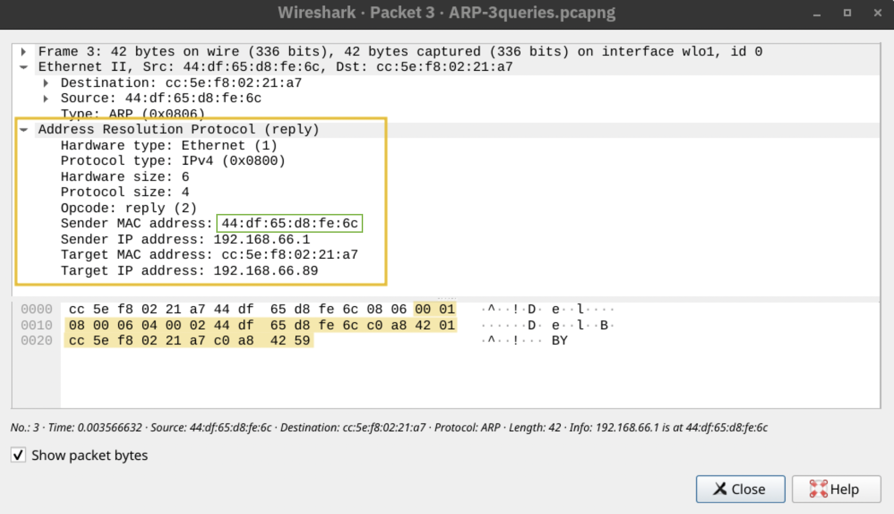

**Difficulty:** Easy  
**Subscription:** Premium  
Click [here](https://tryhackme.com/room/networkingessentials) to access the room

---
> **Note**: This write-up is a concise guide meant to complement the TryHackMe Networking Essentials room. It is not a comprehensive theoretical resource but rather a practical walkthrough of key concepts and tasks. For deeper explanations, refer to the room materials or other Networking documentation.

> **Note**: If you come across abbreviations or terms you’re unsure about, check the [Networking Glossary](../Networking-Glossary), most of them should be explained there!

## Room Setup
No special setup is required for this room. Just work through each task, answer the questions and click the “View Site” button in the final task to complete the interactive challenge and obtain the flag.

---
## 🧩 Tasks Breakdown
### Task 2

#### ❓ How many steps does DHCP use to provide network configuration?

**Answer:** 4

**Explanation:** Remember Dora?

In our case, it stands for **D**iscover, **O**ffer, **R**equest and **A**cknowledge. These are the steps followed by DHCP. In the Discover step, the client sends a DHCPDISCOVER message to find out if there is any DHCP server(s) in the network (or not). In the Offer step, the server answers by including an available IP address for the client and other TCP configuration information in the DHCPOFFER message. In the Request step, the client sends a DHCPREQUEST message to the server, indicating the acceptance of the IP address and other TCP/IP configuration. And, at last, in the Acknowledge step, the server sends a DHCPACK message confirming that the IP address has indeed been assigned to the client.

#### ❓ What is the destination IP address that a client uses when it sends a DHCP Discover packet?

**Answer:** 255.255.255.255

**Explanation:**  The client sends packets to 255.255.255.255 as this is the broadcast IP address  (we are using the broadcast address simply because the DHCPDISCOVER message is broadcast to find the DHCP server(s) (if one exists)).

#### ❓ What is the source IP address a client uses when trying to get IP network configuration over DHCP?

**Answer:** 0.0.0.0

**Explanation:**  It is 0.0.0.0, because, at this point, the client doesn't have an assigned IP address.

### Task 3

#### ❓ What is the destination MAC address used in an ARP Request?
**Answer:** ff:ff:ff:ff:ff:ff

**Explanation:** This is the same line of thinking as for the destination IP address used to send DHCP Discover packets. We want to broadcast the ARP request, so we send it to the broadcast MAC address (which is ff:ff:ff:ff:ff:ff as a MAC address is a 48-bit number that is typically represented in hexadecimal notation).

#### ❓ In the example above, what is the MAC address of `192.168.66.1`?
**Answer:** 44:df:65:d8:fe:6c

**Explanation:** Here's where you could spot it in the 3 cases shown (notice how you can almost read in natural language the first two, with the "is at" and "is-at").

### Task 4
#### ❓ Using the example images above, how many bytes were sent in the echo (ping) request?
  
**Answer:** 40

**Explanation:** Don't make the same mistake I made here. When they ask "how many bytes were sent in the echo (ping) request?", it usually refers to the ICMP data (the payload part), not the whole frame. So, you should be looking at the Data field (which in this case is 40 bytes), instead of looking at the total size of the captured packet.

#### ❓ Which IP header field does the `traceroute` command require to become zero?
  
**Answer:** TTL

**Explanation:** The way *traceroute* works is that it uses ICMP replies to figure out which router is at what hop. So, it sends out packets with TTL = 1, 2, 3, 4... and so on and each router along the path decrements the TTL by 1. When TTL reaches 0, the router discards the packet and sends back an ICMP “Time Exceeded” message. Even though, you don't see the TTL printed in the traceroute command output, this is how you get to see the names and response times from the routers. If this explanation sounds a bit confusing, watch [this](https://www.youtube.com/watch?v=vUnCXVuH16Y).

### Task 5
#### ❓ Which routing protocol discussed in this task is a Cisco proprietary protocol?
**Answer:** EIGRP

**Explanation:** EIGRP, which stands for Enhanced Interior Gateway Routing Protocol, is a Cisco proprietary routing protocol. As mentioned in the room, "it allows routers to share information about the networks they can reach and the cost (like bandwidth or delay) associated with those routes. Routers then use this information to choose the most efficient paths for data transmission.".

### Task 6
#### ❓ In the network diagram above, what is the public IP that the phone will appear to use when accessing the Internet?
**Answer:** 212.3.4.5

**Explanation:** In this diagram, we have a router that supports NAT. As it is mentioned in the room, the router maintains a table that maps the internal IP address and port number with its external IP address and port number. So, in this particular case, when the phone accesses the internet, from its perspective, the connection is initiated from its IP address 192.168.0.137 from TCP source port number 27912. However, on the external network, this same connection wil be seen as being established from 212.3.4.5 and TCP port number 32759, as shown in the translation table.

#### ❓ Assuming that the router has infinite processing power, approximately speaking, how many **thousand** simultaneous TCP connections can it maintain?
**Answer:** 65

**Explanation:** The number of TCP connections are limited by the number of TCP port numbers. So, assuming that the router has infinite processing power, it would be able to maintain about 65 thousand simultaneous connections. If you forgot where this number comes from, check [this](../Networking-Concepts/#-what-is-the-approximate-number-of-port-numbers-in-thousands) out.

### Task 7
#### ❓ Click on the **View Site** button to access the related site. Please follow the instructions on the site to obtain the flag.
**Answer:** THM{computer_is_happy}

**Explanation:** I'm not 100% sure if the questions will be the same (and if they are, if they will be in the same order), but here are the ones I got: 

- I am curious about tracing the route of packets as they travel to their destination server. What protocol would let me discover the path? **ICMP**
- We need to give 25 devices Internet access; however, we only have one public IP address. What can we use to allow multiple private IP addresses to use a single public IP address? **NAT**
- I want to find another host's hardware (MAC) address on the network. Which protocol lets me get this information? **ARP**
- I want to obtain an IP address to use and communicate with the other hosts on the network. What should I use? **DHCP**

## Confusion.log
#### 💭 Washing machines can have IP addresses? What for?!

**Answer:** Yes, apparently washing machines can have IP addresses! Smart washers connect to your home network so you can control them from your phone. You can start or stop cycles, schedule them, get alerts when a load is done or even run them with voice commands. It’s all about convenience, automation and fewer trips to the laundry room.

#### 💭 How come the number of IP addresses is always expressed as a power of two?

**Answer:** Every IP address is made up of bits. For example, IPv4, that's 32 bits, so there are 232 total unique IPv4 addresses. When we create subnets, we are dividing the address space by "stealing" bits and every time we take a bit, we halve the number of available addresses. So if you allocate:

- 1 bit &rarr; 21 = 2 addresses
- 2 bits &rarr; 22 = 4
- ...
- n bits &rarr; 2n

Each subnet always has 2n IP addresses because each additional bit you assign doubles the number of possible combinations.

  Thanks for sticking around until the end! I hope this was helpful. Got questions, feedback or something cool to add? Hit me up in the comment section. See you next time!!!

  Join the <a href="#" data-eo-form-toggle-id="bf3ab678-3118-11f0-9f74-59c668a2a47a" 
    style="color: #007acc; text-decoration: underline; cursor: pointer; opacity: 1;"
  >mailing list</a> so you never miss me confidently running a command I absolutely shouldn’t.

