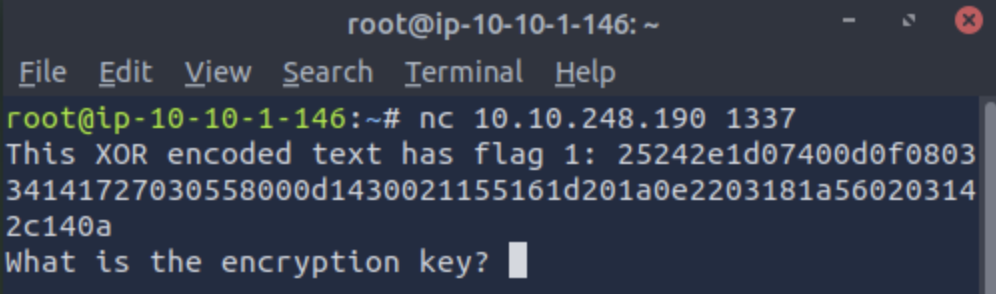

**Difficulty:** Easy  
**Subscription:** Free  
Click [here](https://tryhackme.com/room/w1seguy) to access the room

---
> **Note**: This write-up is a hands-on, learner-friendly walkthrough of the *W1seGuy* room on *TryHackMe*. It focuses on the problem-solving mindset, breaking down logic and sharing “aha!” moments. It doesn’t aim to be a theoretical deep-dive on the methods used to solve the room.


## Room Setup

In this room, you have to download the provided source code and start a virtual machine. The machine runs a TCP server on port 1337, which you can connect to using *netcat* or a similar tool.

---
## 🧠 Brain Dump

####  Connecting to the server

First challenge, here we go!!! So, to start off, we need to connect to the server where the challenge is running.
As mentioned above, you can do this using *netcat*:

```bash
nc <Target IP Address> 1337
```

You should see something similar to this:


> ⚠️ **Heads up!** The encoded text you get will likely be different from mine.


####  Understanding the source code
Let’s take a look at the source code. What is it doing? Upon a quick glance, the functions we should focus on are *start()* and *setup()*. That’s where the real magic happens. 

Let’s start with *start()*. I wrote comments throughout the code to clarify each step.

```python
# It takes `server` as an argument
def start(server):
  # It creates a variable called `res`, which is a string of length 5.
  # This string will be composed of ASCII letters and/or digits.
  # So the keyspace is `abcdefghijklmnopqrstuvwxyzABCDEFGHIJKLMNOPQRSTUVWXYZ0123456789`.  
  res = ''.join(random.choices(string.ascii_letters + string.digits, k=5))
  # This next step is a bit redundant because, at this point, `res` is already a string
  key = str(res)
  # The next line takes us to the setup() function, so I advise you to skip there now 
  # (go down on the page)
  hex_encoded = setup(server, key)
  # The next line is what shows up in the terminal. Note that it doesn’t show up
  # looking like hexadecimal directly, since it is sent over as a UTF-8 string
  # because of how send_message() works.
  send_message(server, "This XOR encoded text has flag 1: " + hex_encoded + "\n")
  
  send_message(server,"What is the encryption key? ")
  key_answer = server.recv(4096).decode().strip()

  try:
    if key_answer == key:
      send_message(server, "Congrats! That is the correct key! Here is flag 2: " + flag + "\n")
      server.close()
    else:
      send_message(server, 'Close but no cigar' + "\n")
      server.close()
  except:
    send_message(server, "Something went wrong. Please try again. :)\n")
    server.close()
```


Before going through *setup()*, here is a quick tip if you are not super familiar with `ord()` and `chr()`:
- [`ord()`](https://www.geeksforgeeks.org/ord-function-python/) gets the Unicode code point of a character
- [`chr()`](https://www.geeksforgeeks.org/chr-in-python/) does the reverse. It turns a Unicode code point into a character

```python
# It takes `server` and `key` as arguments, but `server` isn't actually used
def setup(server, key):
  # There is this dummy line. Mind that this is NOT the real flag
  flag = 'THM{thisisafakeflag}' 
  xored = ""

  # In this loop, each i-th character of xored is the result of XORing the
  # Unicode code point (ord value) of the i-th character of the flag with the
  # ord value of a character from the key, chosen based on i % len(key)
  # (to loop the key). We do this because the key length is only 5 and this
  # way it cycles properly.
  for i in range(0,len(flag)):
    xored += chr(ord(flag[i]) ^ ord(key[i%len(key)]))

  # We encode `xored` to hexadecimal
  hex_encoded = xored.encode().hex()
  return hex_encoded # now get back to the start() function
```
#### Solving the challenge
**What is the first flag?**  
Let's break this down:
- We know that the `hex_encoded` string is the XOR of the **real flag** with a 5 character key
- Because XOR is applied character by character and the key loops, the final xored result has the same length as the original flag
- Given that it is a *TryHackMe* challenge, we can **assume** the flag format is "THM{...}"

Thinking the same thing as me? It is time for a plaintext attack!  
Stay with me here.

We know the key length is 5 and from the source code, we know that:  
`xored += chr(ord(flag[i]) ^ ord(key[i%len(key)]))`  
So we can work backwards.

I thought about it almost like a math equation. We can rewrite the above expression as:  
`xored[i] = chr(ord(flag[i]) ^ ord(key[i%len(key)]))`  

So,  
`ord(xored[i]) = ord(flag[i]) ^ ord(key[i%len(key)])`  

Using XOR’s reversible property, we rearrange to get  
`ord(flag[i]) = ord(xored[i]) ^ ord(key[i%len(key)])`  
And finally, turn that back into a character:  
`flag[i] = chr(ord(xored[i]) ^ ord(key[i%len(key)]))`  

And then to  
`flag += chr(ord(xored[i]) ^ ord(key[i%len(key)]))`  


So, don't forget:
- **Encryption**: `xored += chr(ord(flag[i]) ^ ord(key[i%len(key)]))`  

- **Decryption (reversing the XOR)**: `flag += chr(ord(xored[i]) ^ ord(key[i%len(key)]))`  


The last expression is what we get to find the flag. We know the value of `xored`, but we don't know the value of `key`... How can we work this out with the data we have in hand?
Well, now is where the cool part comes, we brute-force all possible 5 character keys from the valid keyspace, apply the decryption process and check if the result starts with "THM{" and ends with "}". This way, you will be recovering both the key and the first flag! 

**What is the second and final flag?**  
You will be getting this one when you enter the key you discovered in the terminal.

#### My solution code
Get my `.py` solution file [here](/assets/files/w1seguy.py).

Summary of what we have been up to: we reversed the XOR logic from the source code, brute-forced all 5 char keys to find the right one and once we found a flag that fit the format, we got both flag 1 (used to answer the web question) and the key (used to answer the prompt inside the *netcat* session). After entering the correct key in the terminal, we were rewarded with the second flag.

## Confusion.log
#### 💭 In `xored.encode().hex()`, why do we have to use `encode()`?

**Answer:** Because `.hex()` only works on bytes and `.encode()` returns bytes. If we tried `xored.hex()` directly, it would fail because `xored` is still a string at that point.

## Bumps and Bruises
##### ❗️ Please please please, don’t make the same mistake as I!
When you see `flag = ‘THM{thisisafakeflag}'`, it **is** (!!) a fake flag. I spent so much time because I was distracted and overlooked this detail... Moral of the story: read the questions carefully and understand exactly what is being asked before jumping to conclusions.


<div style="text-align: center; font-size: 1em;">
  First challenge is done!!! Hope you had a good time. See you!
</div>

<div style="text-align: center; font-size: 0.8em; opacity: 0.6;">
  Join the <a href="#" data-eo-form-toggle-id="bf3ab678-3118-11f0-9f74-59c668a2a47a" 
    style="color: #007acc; text-decoration: underline; cursor: pointer; opacity: 1;"
  >mailing list</a> so you never miss me confidently running a command I absolutely shouldn’t.
</div>

<script>
  if (!window.__eo_script_loaded) {
    window.__eo_script_loaded = true;
    const s = document.createElement("script");
    s.src = "https://eocampaign1.com/form/bf3ab678-3118-11f0-9f74-59c668a2a47a.js";
    s.setAttribute("data-form", "bf3ab678-3118-11f0-9f74-59c668a2a47a");
    s.async = true;
    document.body.appendChild(s);
  }
</script>