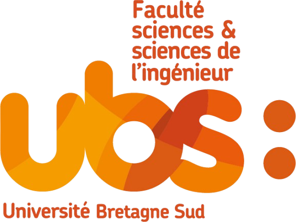
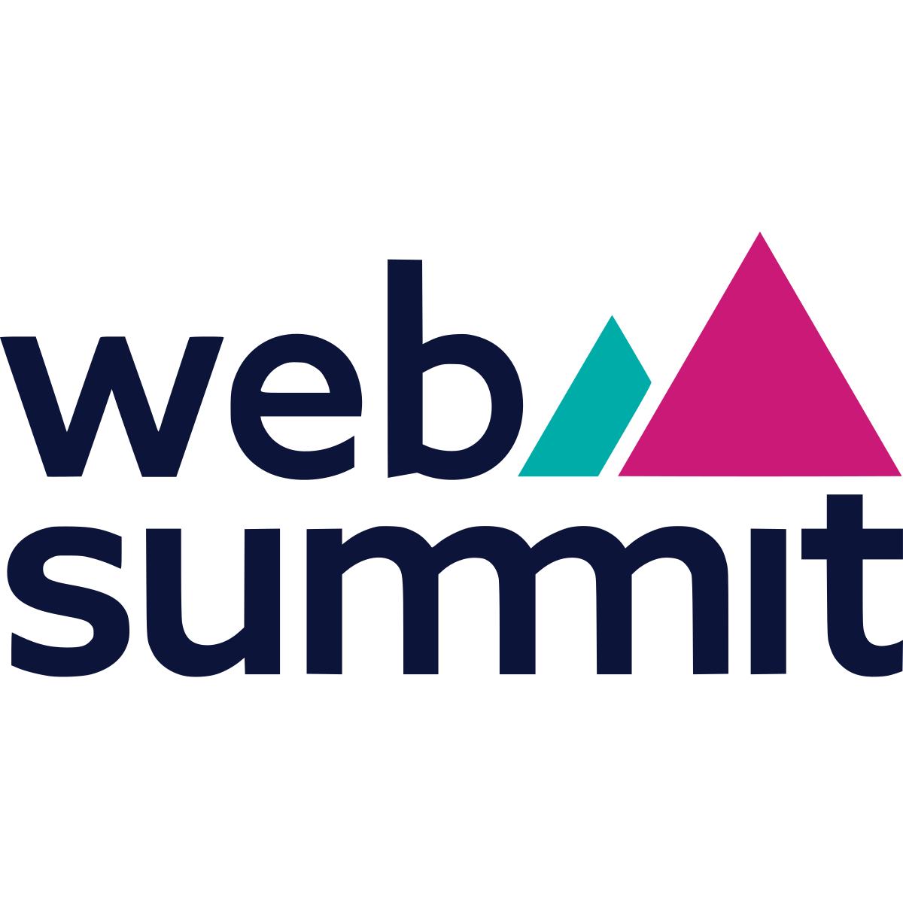
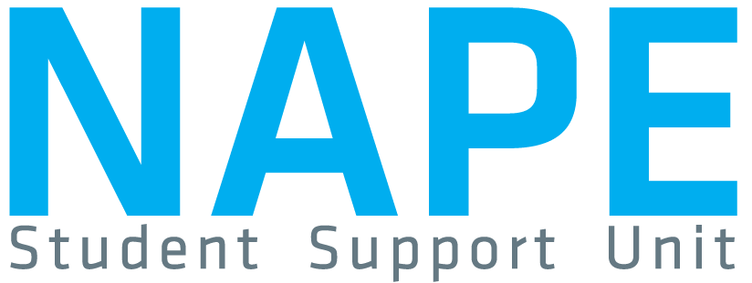
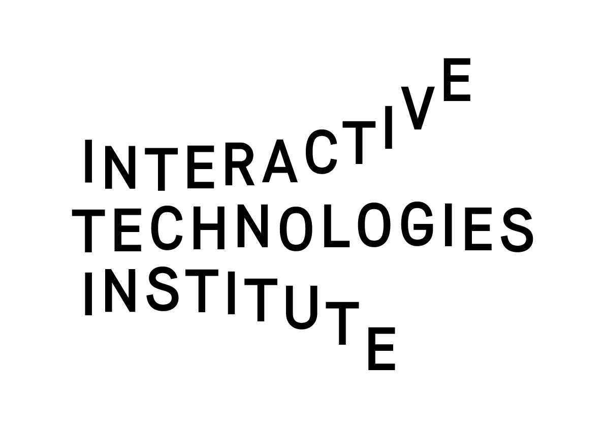

---
# the default layout is 'page'
icon: fas fa-info-circle
order: 4
---

I'm Bianca Fonseca, a curious and hardworking cybersecurity student pursuing the **CYBERUS Erasmus Mundus Joint Master’s**, specializing in **IoT Security**. I enjoy tackling complex problems, breaking them down and finding solutions. I'm always eager to learn and grow in new fields!

---

## 🎓 Education

  
  

    <strong>Université Libre de Bruxelles</strong>, Belgium 
    MSc CYBERUS - Specialization in Cybersecurity 
    <em>Incoming 2025–2026</em>
  

  
  

    <strong>TalTech – Tallinn University of Technology</strong>, Estonia 
    NATO-Focused Winter School 
    <em>01/2025</em>
  

  
  

    <strong>Université Bretagne Sud</strong>, France 
    MSc CYBERUS - Specialization in Complex Systems Engineering 
    <em>2024–2025</em>
  

  
  

    <strong>Instituto Superior Técnico – University of Lisbon</strong>, Portugal 
    BSc in Computer Science and Engineering 
    <em>2021–2024</em>
  

---

## 💼 Experience

  
  

    <strong>Amazon</strong> – System Dev Engineer Intern (ICON team), Ireland 
    Developing tools to improve service availability and security across global infrastructure.
     
    <em>04/2025 – present</em>
  

  
  

    <strong>Web Summit</strong> - Operations/ Response & Support Team 
    Provided rapid response and support for high-scale tech events.
     
    <em>11/2023</em>
  

  
  

    <strong>NAPE</strong> - Mentor 
    Guided new students at IST with academic and social integration.
     
    <em>09/2023 – 07/2024</em>
  

  
  

    <strong>Interactive Technologies Institute</strong> - Research Initiation Fellowship 
    Co-designed inclusive digital solutions for underserved communities.
     
    <em>06/2023 – 09/2023</em>
  

  
  

    <strong>HackerSchool</strong> - Board Member, Marketing 
    Led marketing efforts and contributed to open-source tech projects.
     
    <em>08/2022 – 10/2023</em>
  

  
  

    <strong>Farfetch</strong> - Plug-In Mentoring for Girls 
    Completed a one-year mentorship program inspiring girls in tech.
     
    <em>05/2021 – 05/2022</em>
  

  
  

    <strong>Easy Future</strong> - Director of External Relations & Treasurer 
    Expanded a student-led initiative nationwide.
     
    <em>07/2020 – 01/2022</em>
  

---

## 🧠 Technical Skills

Python • Java • C/C++ • Wireshark • Ghidra • Git • SQL • Assembly  
LaTeX • Prolog • PLSQL • R

---

## 🌐 Languages

- Portuguese (Native)  
- English (Professional proficiency)  
- Spanish (B1)  
- French (B1)

---

## 🧪 Projects & Contributions

- **Facial Expression Recognition Research**: used FACS (Facial Action Coding System) for robotic head control, implemented features in Python.  
- [**p5.js (open source contribution)**](https://github.com/processing/p5.js/pull/7060): fixed resource leak in `p5.Graphics.remove()` (PR #7060).

---

> Want to connect or collaborate? Reach out via [email](mailto:bsnfonseca@gmail.com) or [LinkedIn](https://www.linkedin.com/in/bianca-fonseca/).
